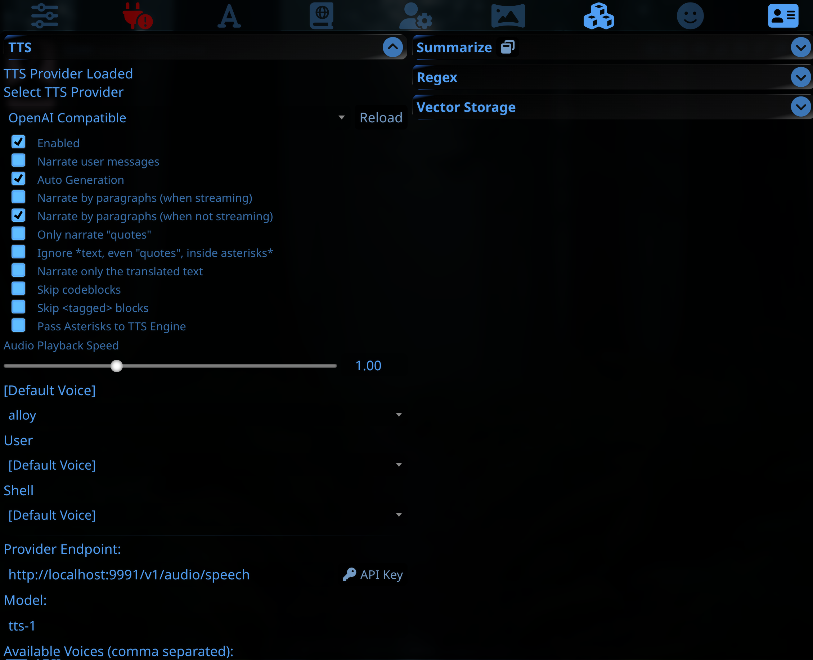
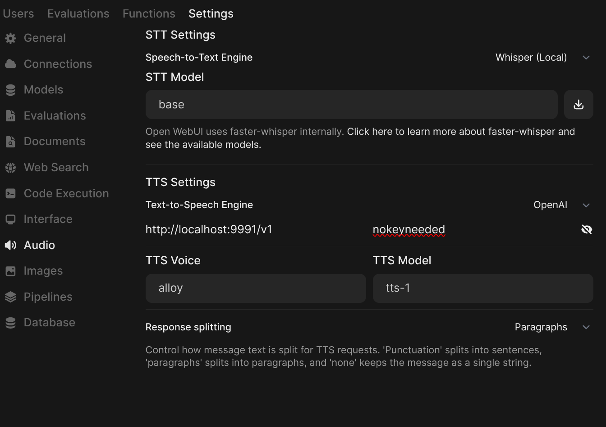

# Spark-TTS-cli-api
(Try listening to this part; this is `male1.wav`!)

[readme1.webm](https://github.com/user-attachments/assets/29ec16d9-917f-4254-8aaf-77686f2234ed)

This is a humanized fork of [Spark-TTS](https://github.com/SparkAudio/Spark-TTS) that adds an OpenAI compatible text to speech API. This means you can actually use the amazing capability of Spark-TTS in real programs, instead of just a tech demo.

This fork is capable of processing an unlimited amount of text at once. It uses intelligent semantic text splitting to overcome the limitations of the original repo. It has quality of life improvements that make it suitable as a hands-off TTS provider. It will trim out excessive silence, and retry failed segments.

Generally, this smooths over all the bumps usually encountered with local text to speech models.

These improvements allow Spark-TTS to be used as a seamless drop in replacement for OpenAI. This means it will work with programs like [SillyTavern](https://github.com/SillyTavern/SillyTavern) and others. It can be easily used to read stories, roleplay, chat, and so on.

It takes about 8.5 GB vram, small enough to fit and run at about 2x realtime on an RTX 3060. Anything larger will have an easy time running this model at much faster than real time.

This was built off the work of the original model authors, and especially the foundational work of [@AcTePuKc's script](https://github.com/SparkAudio/Spark-TTS/issues/10). This would not have been possible without [@AcTePuKc](https://github.com/AcTePuKc)'s inference script.

Right now, it is designed to be used locally by one user, processing one request at a time. Multi-user (concurrent requests) generation works, but it is not as stable as it could be.

The program is a work in progress, but right now, pretty great!

There's two ways to get text to speech:
- Connect to a program like SillyTavern and have it read what you want on demand.
- Have it read a `.txt` file and give you a `.wav` audio file to listen to or share.

## To-Do List

- [ ] Add the ability to have multiple voice cloning sources loaded and selectable by API.
- [ ] Switch to a more production stable HTTP API hosting solution.
- [ ] Always split segments by paragraph.
- [ ] Add more diverse voice presets.
- [ ] Improve logic to reduce or eliminate entirely bad segments passed to the API when using unfamiliar voices.
- [ ] Reduce VRAM usage by using Spark-TTS-Fast.
- [X] Better handling of apostrophes and quotes (fancy unicode quotes break the model).

---

# Install

## Linux install:

Clone the repo
``` sh
git clone https://github.com/dogarrowtype/Spark-TTS-cli-api
cd Spark-TTS
```

- Needs `python3.11` or `python3.12`

Install with conda or pip:

Conda install method:
- Install Conda: please see https://docs.conda.io/en/latest/miniconda.html
``` sh
conda create -n sparktts -y python=3.12
conda activate sparktts
pip install -r requirements.txt
# If you are in mainland China, you can set the mirror as follows:
#pip install -r requirements.txt -i https://mirrors.aliyun.com/pypi/simple/ --trusted-host=mirrors.aliyun.com
```

Alternative `pip` install method:
``` sh
python3.12 -m venv ./venv
source ./venv/bin/activate
pip install -r requirements.txt
# If you are in mainland China, you can set the mirror as follows:
#pip install -r requirements.txt -i https://mirrors.aliyun.com/pypi/simple/ --trusted-host=mirrors.aliyun.com
```

**Model Download**

Download via huggingface-cli command:
```sh
huggingface-cli download SparkAudio/Spark-TTS-0.5B --local-dir "pretrained_models/Spark-TTS-0.5B"
```

`ffmpeg` is an optional requirement. It's nice to have, but not critical. If you can't get it, don't worry. It just converts the output wav to mp3 for slightly less bandwidth usage.

## Windows install:

**Step 1: Get miniconda**

Install [miniconda](https://www.anaconda.com/docs/getting-started/miniconda/install#windows-installation)

**Step 2: Get the files**

You have two options to get the files:

Option 1 (Recommended for Windows): Download ZIP manually

- Click "Code" > "Download ZIP" at the top of the page, then extract it to the same folder you've chosen to work in.
- You should have a "Spark-TTS-cli-api" folder inside your chosen install folder.

Option 2: Use Git (Optional, allows for easy updates)

- If you prefer using Git, install [Git](https://git-scm.com/downloads).
- Then open a Command Prompt (cmd) in the folder you would like to install in, and run:
``` sh
git clone https://github.com/SparkAudio/Spark-TTS.git
cd Spark-TTS-cli-api
```

**Step 3: Create a miniconda environment**

Open Command Prompt (cmd) in your Spark-TTS-cli-api folder, and run:
``` sh
conda create -n sparktts python=3.12 -y
conda activate sparktts
```
This creates and activates a Python 3.12 environment for Spark-TTS.

**Step 4: Install dependencies**

``` sh
pip install -r requirements.txt
pip install torch torchaudio --index-url https://download.pytorch.org/whl/cu124
```

**Step 5: Get the model**

Download via huggingface-cli command:
``` sh
huggingface-cli download SparkAudio/Spark-TTS-0.5B --local-dir "pretrained_models/Spark-TTS-0.5B"
```

**Step 6: Ready to start**

You should be good to go. Run the command from "Basic Usage" below that fits your needs.

---

# Basic Usage

If you installed using conda/miniconda, remember to activate it first:
``` sh
conda activate sparktts
```

## API server
To start the API server on port 9991:
``` sh
python ./tts_server.py --prompt_audio "voice_samples/female2.wav"
```
Since there is no streaming version yet, it will need to generate the entire output before sending the result over the API. With SillyTavern, this isn't as much of a problem since requests can be sent a paragraph at a time.

## .TXT file reader
Alternatively, you can run a command line interface that will read text input：

``` sh
python ./cli/tts_cli.py --text "Hello, nice to meet you." --prompt_audio "voice_samples/female2.wav"
```

Or have it **read text from a file**:
``` sh
python ./cli/tts_cli.py --text_file "[path to your .txt file]" --prompt_audio "voice_samples/female2.wav"
```

This will save the output to the folder `examples/results` inside Spark-TTS-cli-api.

Try `--help` to see all options.

## Switching the voice
Several working (and consistent) voices are provided in `voice_samples`. To switch to another voice, simply change out `female2.wav` for another voice.

Personally I recommend using `male1.wav` or `female2.wav`. Right now, those voices are hyper-consistent and the most fun to listen to (subjectively).

**Provided voice descriptions**
- female1.wav: melancholy, rainy
- female2.wav: confident, expressive
- female3.wav: anime VA, cutesy, kinda sad, amazed
- female4.wav: clean, light, a touch of mystery
- male1.wav: cute, super expressive, adventurous
- male2.wav: determined, focused
- male3.wav: surprised, best for short bursts
- male4.wav: deep, rich, noir, serious
- male5.wav: alternate version of male4.wav, expressive, deep, rich, engaging

---

<table>
<tr>
<td align="center">
    
**Female 1**
</td>
<td align="center">
    
**Female 2**
</td>
</tr>

<tr>
<td align="center">

[female1.webm](https://github.com/user-attachments/assets/f859e295-a290-49be-8c69-f793bf69e3e0)

</td>
<td align="center">
    
[female2.webm](https://github.com/user-attachments/assets/77488785-5d48-477b-a2d4-33db4abe95fd)

</td>
</tr>
</table>

---

<table>
<tr>
<td align="center">
    
**Female 3**
</td>
<td align="center">
    
**Female 4**
</td>
</tr>

<tr>
<td align="center">

[female3.webm](https://github.com/user-attachments/assets/d84cb42e-6a1c-49de-a397-606e0fafbd82)

</td>
<td align="center">
    
[female4.webm](https://github.com/user-attachments/assets/1c931e30-8669-4f55-addd-e21ab94687e5)

</td>
</tr>
</table>

---

<table>
<tr>
<td align="center">
    
**Male 1**
</td>
<td align="center">
    
**Male 2**
</td>
</tr>

<tr>
<td align="center">

[male1.webm](https://github.com/user-attachments/assets/c29ba86c-9394-4b28-bcf6-1b24c02dbf02)

</td>
<td align="center">
    
[male2.webm](https://github.com/user-attachments/assets/d79030ec-ffdc-437f-8333-0b6010e6d374)

</td>
</tr>
</table>

---

<table>
<tr>
<td align="center">
    
**Male 3**
</td>
<td align="center">
    
**Male 4**
</td>
</tr>

<tr>
<td align="center">

[male3.webm](https://github.com/user-attachments/assets/3bc720d6-286e-4904-8d57-fdea3055c288)

</td>
<td align="center">
    
[male4.webm](https://github.com/user-attachments/assets/da9ff132-3508-46c0-ba4c-1c0658a0624d)

</td>
</tr>
</table>

---


<table>
<tr>
<td align="center">
    
**Male 5**
</td>
<td align="center">
    
**Male 6 (not yet found)**
</td>
</tr>

<tr>
<td align="center">

[male5.webm](https://github.com/user-attachments/assets/ad830d60-a493-4736-a7da-49480c3d0190)

</td>
<td align="center">

Not yet found.

</td>
</tr>
</table>

---

**Voice cloning**

To clone another voice, gather a 5 to 20 second `.wav` voice clip of clear audio of your speaker. Background noise/music should absolutely be avoided. A single long sentence can work great. A single instance of your voice speaking continuously is best. Multiple very short (less than 5 second) clips edited together do not seem to work well. Your clone source file should be in `.wav` format (but others may work).

In the above "Basic Usage" commands, switch out `female2.wav` for your new clone voice, and hope for the best. Follow the second generation cloning advice below to get better results.

Cloned voices seem to work better when using a second generation clone. Meaning, clone a voice, try generating a few different times, then use the result you like best as a clone for future generations.

Simply put:
- Generate a few samples with your desired clone voice
- Find one that has the correct accent/sound
- Use that perfect result as clone input to get consistent long generations

I use this phrase to create second generation clone clips. It has a good coverage of emotions and accents:
```
In these days of skeptical enlightened civilization one cannot claim to have seen a sea serpent and expect anything but laughter. And this was even more incredible. The ship's commander, within a few hours, even doubted the evidence of his own senses. But from the sailors the tale leaked out. And a whole ship's company cannot be insane, or all similarly drunk at once.
```

**Random voices**

If you don't specify a clone source, you must specify `--gender`. You'll get a random voice for each chunk. This is useful to find new voices, and use those as clone sources. However, for normal usage, I don't suggest leaving it on random as the output will be chaotic.

---

## SillyTavern usage

SillyTavern Settings
 
Change SillyTavern TTS settings (in the "Extensions" menu at the top) match this screenshot. "Narrate by paragraphs (when not streaming)" is very important to reduce latency and increase quality.

---

## Open-Webui usage
Open-Webui Settings
 
In the [Open-Webui](https://github.com/open-webui/open-webui) admin panel, go to "audio" and set the TTS provider to `http://localhost:9991/v1`. Set "response splitting" to "paragraphs" to reduce latency and increase quality.

---

## Known issues
- Clone voices can be unstable across many segments if unfamiliar to the model. (Switching from a US English to UK English interpretation if it can't decide).
- (Mostly only an issue with custom clone voices) The segment retry can cause a bit of a traffic jam. If it has to retry a segment on a slow gpu, there may be a break in streaming output with SillyTavern. It *will* eventually continue, but there can be a pause while it tries to catch up. This is especially confusing in SillyTavern since there is no indicator that voice is being generated. It can appear like the request has failed, even though it is still generating.
- Segments that go off the rails halfway through and then pick up much later are not detected and retried.

Tested with a RTX 3060 12gb GPU on linux with python3.12, and a RTX 4090 GPU on windows with python 3.12. CPU is untested and unsupported.

---
## Original Readme (partial)

### Overview

Spark-TTS is an advanced text-to-speech system that uses the power of large language models (LLM) for highly accurate and natural-sounding voice synthesis. It is designed to be efficient, flexible, and powerful for both research and production use.

### Key Features

- **Simplicity and Efficiency**: Built entirely on Qwen2.5, Spark-TTS eliminates the need for additional generation models like flow matching. Instead of relying on separate models to generate acoustic features, it directly reconstructs audio from the code predicted by the LLM. This approach streamlines the process, improving efficiency and reducing complexity.
- **High-Quality Voice Cloning**: Supports zero-shot voice cloning, which means it can replicate a speaker's voice even without specific training data for that voice. This is ideal for cross-lingual and code-switching scenarios, allowing for seamless transitions between languages and voices without requiring separate training for each one.
- **Bilingual Support**: Supports both Chinese and English, and is capable of zero-shot voice cloning for cross-lingual and code-switching scenarios, enabling the model to synthesize speech in multiple languages with high naturalness and accuracy.
- **Controllable Speech Generation**: Supports creating virtual speakers by adjusting parameters such as gender, pitch, and speaking rate.

---


## ⚠️ Usage Disclaimer

This project provides a zero-shot voice cloning TTS model intended for academic research, educational purposes, and legitimate applications, such as personalized speech synthesis, assistive technologies, and linguistic research.

Please note:

- Do not use this model for unauthorized voice cloning, impersonation, fraud, scams, deepfakes, or any illegal activities.

- Ensure compliance with local laws and regulations when using this model and uphold ethical standards.

- The developers assume no liability for any misuse of this model.

We advocate for the responsible development and use of AI and encourage the community to uphold safety and ethical principles in AI research and applications. If you have any concerns regarding ethics or misuse, please contact us.
